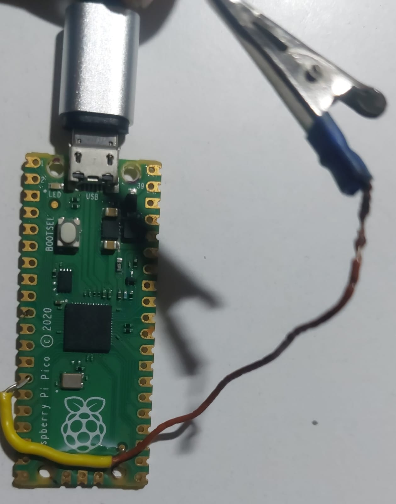

# AFKC_AwayFromKeyboardComamnd
A simple HID device inspired from rubber ducky made from rasberry pi pico. This guide is for educational purposes only.

 ## Setup

- You first need to conect GPIO10 on a Razberry pi pico with a modified crocodile clip or a other conection. Then mark the 3.3v pin with a marker but don't cover the conection, you will need it.
- Connect the Raspberry Pi Pico to your computer while holding down the BOOTSEL button. When it appears as a removable storage device, release the BOOTSEL button.
- Download this repository and extract it, open the **format_pico folder** from the files provided. Copy the flash_nuke.uf2 file to the Raspberry Pi Pico. Wait until it restarts. This process clears the existing firmware.
- Open the **software** folder. Copy the **adafruit-circuitpython-raspberry_pi_pico-en_US-9.1.1.uf2** file to your Raspberry Pi Pico. Wait until it restarts. After restarting, the Pico should appear as a drive named CIRCUITPY.
- Copy the **lib** folder on the CIRCUITPY drive, click replace if it asks.
- Copy the **payload.py** and **code.py**, click replace if it asks. Congratulations! Your AFKC is set up and ready to go. (WARNING: MAKE SURE THAT THW WIRE ISEN'T CONECTED)

 ## Payloads
 
 You can write them yourself (Make sure you put the thing in a function named **payload**), ask chatgpt (Make sure you put the thing in a function named **payload**), or use the **DDConvert.html** from **DDConvert** folder using Ducky script and converting, i recomend that you add some pauses using time.sleep(): . Replace payload.py with your code, don't change its name.

 ## How to use
 Unplug the Pico, connect the marked pin to the other wire. The device is now armed. When pluged in, it will run the payload. **DO NOT USE THIS FOR MALICIOUS PURPOSES I AM NOT RESPONSIBLE FOR THE COMPUTERS HARMED WITH THIS DEVICE**
 
